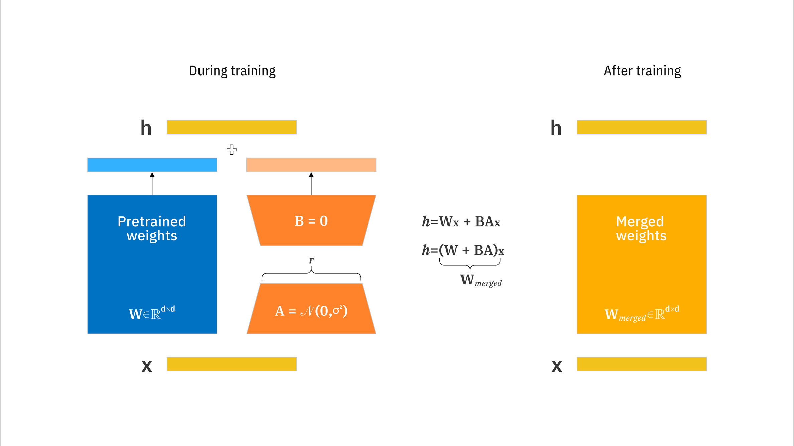
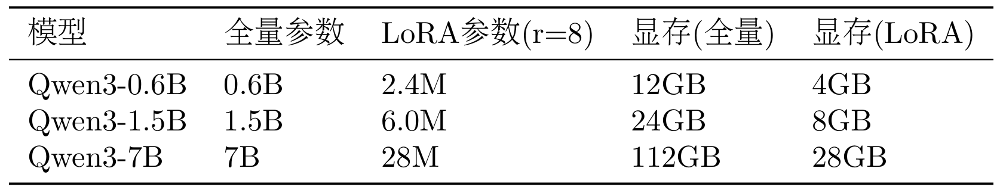

Fine-tuning an entire model directly requires substantial computing resources and GPU memory. For Qwen3-0.6B (0.6 billion parameters), memory requirements cannot be determined from FP16 or FP32 alone: they also depend on the optimizer, sequence length, batch size, and techniques such as gradient checkpointing or offloading. For larger models, such as 7B or 13B, full fine-tuning on a single consumer GPU generally becomes more difficult.

LoRA (Low-Rank Adaptation) is a parameter-efficient fine-tuning method that trains only a small number of additional parameters while keeping the original model parameters frozen. Its central idea is that parameter changes during fine-tuning can be represented by low-rank matrices.

Image source: [IBM](https://assets.ibm.com/is/image/ibm/lora-2:16x9?fmt=png-alpha&dpr=on%2C1.5&wid=1584&hei=891).

## Low-Rank Updates and Parameter Counts

Suppose the original model's weight matrix is $W \in \mathbb{R}^{d \times k}$, and the fine-tuned weights are $W' = W + \Delta W$. LoRA assumes that $\Delta W$ can be decomposed into the product of two low-rank matrices:

$$
\Delta W = BA
$$

Here, $B \in \mathbb{R}^{d \times r}$, $A \in \mathbb{R}^{r \times k}$, and $r \ll \min(d, k)$ is the rank.

During the forward pass, the output is:

$$
h = Wx + \Delta Wx = Wx + BAx
$$

The original model parameters $W$ remain frozen; only $B$ and $A$ are trained.

Parameter comparison: the original model has $d \times k$ parameters, while LoRA has $d \times r + r \times k = r(d + k)$ parameters. When $r \ll \min(d, k)$, LoRA has far fewer parameters than the original model. For example, with $d=4096, k=4096, r=8$, the original parameter count is $4096 \times 4096 = 16,777,216$, while the LoRA parameter count is $8 \times (4096 + 4096) = 65,536$—a reduction by a factor of 256!

This reduction comes from counting parameters: each element of a trainable matrix contributes one scalar parameter. For positive integer dimensions $d,k,r$, the rank of the product matrix is at most $r$, and need not be exactly $r$. For this single weight matrix, the ratio of trainable parameters to the full parameter count is:
$$
\begin{aligned}\frac{\text{LoRA parameters}}{\text{full parameters}}&=\frac{dr+rk}{dk} =\frac{r(d+k)}{dk} =r\left(\frac1k+\frac1d\right),\\\frac{8(4096+4096)}{4096\cdot4096}&=\frac{65{,}536}{16{,}777{,}216} =\frac1{256}=0.00390625,\\\frac{16{,}777{,}216}{65{,}536}&=256.\end{aligned}
$$
Intuitively, two narrow matrices replace one dense trainable update. The frozen base weights and activations still occupy GPU memory; this ratio does not mean that total memory use or runtime also falls by a factor of 256. Biases and any other modules trained alongside them must be counted separately.

## What Rank Means

This constrains the range of updates that can be represented; it does not assert that every effective full fine-tuning update has low rank. Whether the chosen rank is sufficient depends on the task and the layers being adapted. It should be assessed through validation, rather than parameter counts alone.

Full fine-tuning allows this weight matrix to change freely in parameter space, whereas LoRA requires the change to satisfy:

$$
\Delta W=BA
$$

This imposes a mathematical constraint:

$$
\operatorname{rank}(\Delta W) = \operatorname{rank}(BA) \leq r
$$

When $r=8$, no matter how $A,B$ are trained, the resulting update matrix will never have a rank greater than $8$. This can be understood by following the path from input to output:
$$
x\in\mathbb{R}^{4096} \ \xrightarrow{A}\ z\in\mathbb{R}^{8} \ \xrightarrow{B}\ \Delta h\in\mathbb{R}^{4096}
$$
Let the eight columns of $B$ be $\mathbf b_1,\ldots,\mathbf b_8$. Then:

$$
\Delta h=Bz =z_1\mathbf b_1+z_2\mathbf b_2+\cdots+z_8\mathbf b_8
$$

This means that **for this trained LoRA branch, the output corrections produced by different inputs are all combinations of at most eight independent directions.** Specifically:

- $A$ determines how much of each direction to use based on the input, by computing $z_1,\ldots,z_8$.
- $B$ provides the output directions that can be combined.
- During training, both $A$ and $B$ learn, so these directions are not fixed in advance.

The original $W$ can be full rank, and after adding a low-rank update, $W'$ can still be full rank.

| Choice of $r$ | Trainable parameters | Range of representable updates | Practical effect |
| ------------ | ---------- | ---------------- | ---------------------------------- |
| Smaller | Fewer | More constrained | May be sufficient, or may underfit |
| Larger | More | Broader | May improve performance, but may offer little benefit or worsen generalization |

LoRA's main advantages are therefore reducing trainable parameters and their optimizer states, and making adapters easier to save and deploy. Actual GPU memory use, training speed, the degree of overfitting, and performance relative to full fine-tuning still depend on the task and configuration.

The table below reproduces an illustrative comparison of parameter counts and GPU memory from the original learning material. Its memory figures depend on the training configuration and are not fixed requirements.

## Hyperparameters and Scaling

LoRA's key hyperparameters include: rank (r), which controls the rank of the LoRA matrices—a larger rank gives greater expressive capacity but also more parameters, with typical values of 4–64 and a default of 8; Alpha ($\alpha$), LoRA's scaling factor, for which the actual update is $\Delta W = \frac{\alpha}{r} BA$, controlling the strength of LoRA's effect and typically set equal to the rank; and target modules (target_modules), which specify the layers to which LoRA is applied, usually attention layers (q_proj, k_proj, v_proj, o_proj), but potentially also MLP layers (gate_proj, up_proj, down_proj).

Write the scaling factor as $c_{\mathrm{LoRA}}=\alpha/r$, where $\alpha>0$. To explain what dividing by the rank compensates for, let $z_j$ be the independent scalar contributions to a fixed element of $BA$, indexed by $j=1,\ldots,r$. Assume that all terms have a common mean $\mu\in\mathbb R$ and variance $\sigma^2>0$, neither of which changes with $r$. With $\alpha$ fixed, linearity of expectation and addition of variances give:
$$
\begin{aligned}\mathbb E\left[\frac{\alpha}{r}\sum_{j=1}^{r}z_j\right]&=\frac{\alpha}{r}\sum_{j=1}^{r}\mu=\alpha\mu,\\\operatorname{Var}\left(\frac{\alpha}{r}\sum_{j=1}^{r}z_j\right)&=\frac{\alpha^2}{r^2}\sum_{j=1}^{r}\sigma^2 =\frac{\alpha^2\sigma^2}{r},\\\operatorname{Var}\left(\frac{\alpha}{\sqrt r}\sum_{j=1}^{r}z_j\right)&=\alpha^2\sigma^2.\end{aligned}
$$
The factor $1/r$ turns the sum into an average, offsetting the growth in the mean as the number of components increases under these assumptions. This is compensation at the level of the mean. The variance still changes with $r$, so the update's magnitude or norm need not remain constant. After training, the components' means, variances, or correlations may all change with the rank; under the initialization described below, the update is exactly zero. Making $\alpha$ proportional to $r$ only keeps $c_{\mathrm{LoRA}}$ fixed, not the learned update. Initialization, the learning rate, and optimizer states also affect training.

| Scaling method | Expectation | Variance |
| ----------------------------------- | ---------------------- | ------------------------------- |
| $\dfrac{\alpha}{r}\sum z_j$       | $\alpha\mu$          | $\dfrac{\alpha^2\sigma^2}{r}$ |
| $\dfrac{\alpha}{\sqrt r}\sum z_j$ | $\alpha\sqrt r\,\mu$ | $\alpha^2\sigma^2$            |

Under these assumptions—the terms are independent, and $\mu,\sigma^2$ do not change with $r$—dividing by $r$ stabilizes the mean, while dividing by $\sqrt r$ stabilizes the variance.

## Initialization and Weight Merging

Use random initialization for $A_0$ and set $B_0=0$, and define $H_W=\partial\ell/\partial W^\prime\in\mathbb R^{d\times k}$.
$$
\begin{aligned}
\Delta W_0&=c_{\mathrm{LoRA}}B_0A_0=0,\\
\frac{\partial\ell}{\partial A}&=c_{\mathrm{LoRA}}B^\top H_W\in\mathbb R^{r\times k},\\
\frac{\partial\ell}{\partial B}&=c_{\mathrm{LoRA}}H_WA^\top\in\mathbb R^{d\times r},\\
\left.\frac{\partial\ell}{\partial A}\right|_0&=0,\\
\left.\frac{\partial\ell}{\partial B}\right|_0&=c_{\mathrm{LoRA}}H_{W,0}A_0^\top.
\end{aligned}
$$
Initially, the model preserves the base model's output, while $B$ can start learning immediately as long as its gradient is nonzero. The initial task-loss gradient for $A$ is zero, although weight decay may still change it. If both factors are initialized to zero, both task-loss gradients are blocked.

After training, the weights can be merged as follows:

$$
W_{\mathrm{merged}}=W+c_{\mathrm{LoRA}}BA,\qquad h=W_{\mathrm{merged}}x.
$$

Intuitively, merging folds the learned correction into a single weight matrix, eliminating the need for additional adapter matrix multiplications during inference. The earlier shorthand $BA$ omits the scaling factor, or absorbs $c_{\mathrm{LoRA}}$ into one of the factors. The algebraic equality requires the adapter to be fixed and any LoRA dropout to be disabled. Finite precision may introduce rounding differences; merging quantized weights may require dequantization and requantization.

## Key Technical Variants: The Evolution of the LoRA Family

### QLoRA: Quantized LoRA for Further Memory Savings

- Core idea: quantize the base model to 4-bit precision. Compared with 16-bit weights, the bit width used to store the base weights falls to one quarter, while total GPU memory still includes other overhead.

- Effect: with a suitable configuration, enables fine-tuning a 13-billion-parameter model on a consumer GPU with 24 GB of memory.

### LoRA+: Different Learning Rates

- Finding: LoRA's A matrix, which reduces dimensionality, and B matrix, which increases dimensionality, differ in importance.
- Improvement: set a higher learning rate for B than for A, so that $\eta_B/\eta_A>1$. The specific ratio depends on the model and task and needs to be tuned together with the base learning rate.

### AdaLoRA: Adaptive Allocation of the “Attention Budget”

- Problem: using the same rank r for every layer may not be optimal.
- Solution: dynamically assign different ranks to different layers, substantially improving performance with the same number of parameters.
