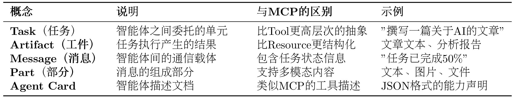
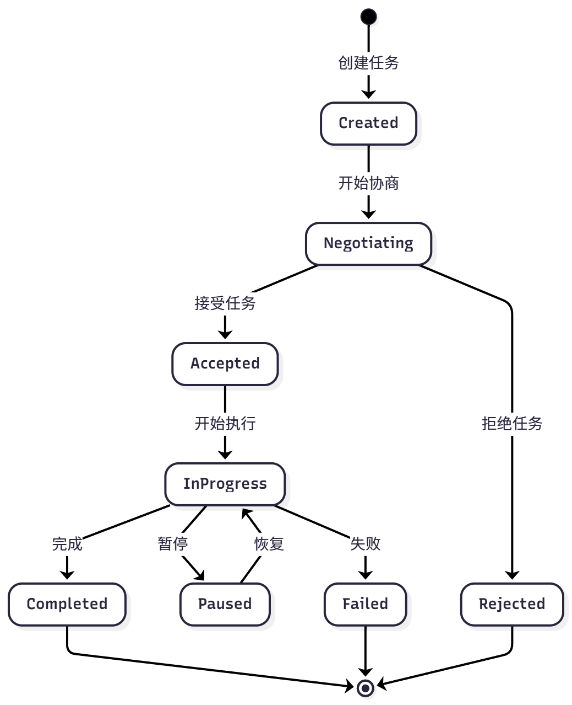
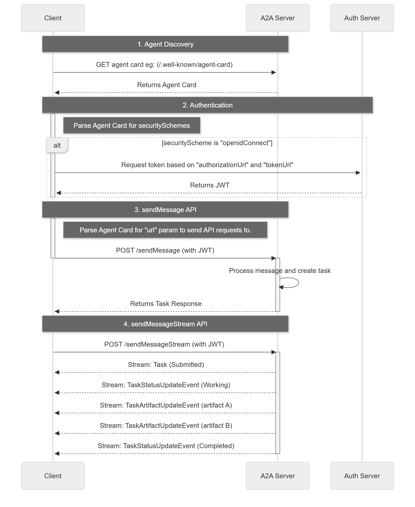
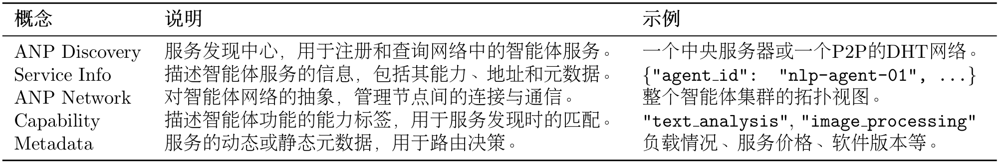
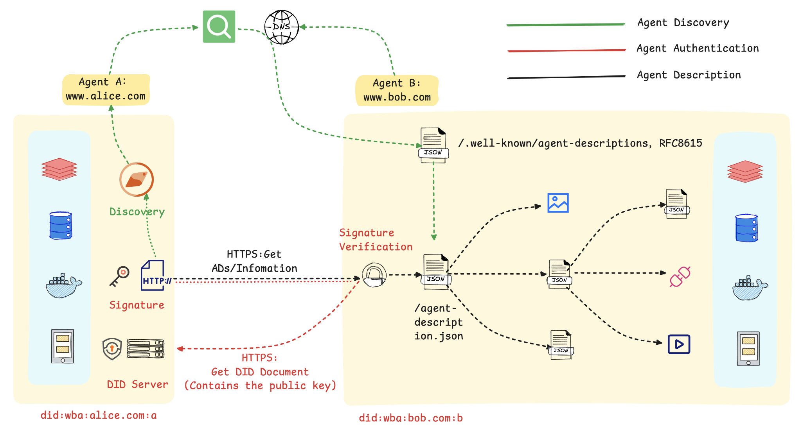

## MCP（Model Context Protocol）

MCP 分三层，分别是上游、MCP 协议、下游。

下游称为 MCP Server/开发者或者厂商。下游负责承载具体业务逻辑，通过 MCP 规范向外注册与暴露三类核心资产：

- **Tools**：供模型调用的函数即工具（如操作 Git、查询 SQL、调用内部微服务）。
- **Resources**：供模型只读挂载的数据上下文（如本地文件、表结构 Schema、日志流）。
- **Prompts**：标准化的交互提示词模板与工作流预设。

上游称为 MCP Client/宿主环境，即常用的各大智能体如 Codex、Claude Code、Pi 等引擎。作为客户端，它们负责生命周期管理、协议转译与权限控制：

- 与配置的多个 MCP Server 建立进程或网络连接。
- 自动发现各 Server 暴露的 Tools/Resources 并在 Prompt 构建阶段转交给 LLM。
- 在模型决定调用某工具时，按标准协议组装请求并分发给目标 Server，将执行结果返回给推理循环。

接着就是 MCP 协议本身了，它是一套标准规范（基于**JSON-RPC 2.0** 的通信与生命周期合约），严格规范了上游和下游的报文格式、状态流转和能力协商，类似于 TCP/IP 这类协议。

整体流程以查询 GitHub 项目并按 star 数排序为例：宿主通过 MCP 获取查询工具的名称、描述和输入 Schema，再向模型提供工具定义。模型生成工具名及符合 Schema 的参数；宿主检查后，通过 `tools/call` 将请求发送给 MCP Server。Server 调用 GitHub API，返回结果，宿主再将结果交给模型。**Schema 由工具提供方定义，模型生成的是调用参数。**

MCP 的作用是统一能力描述和调用接口，减少针对不同服务重复编写通信适配的工作。各服务的业务逻辑、认证方式、权限要求和错误处理仍需分别实现或配置。

宿主可以把 MCP 工具映射为模型支持的工具调用格式，因此模型通常不需要直接处理 MCP 报文。Resources 和 Prompts 则按各自的协议接口使用，不应默认把所有内容都转换成工具或自动注入上下文。

MCP 协议的一个巨大优势是<strong>丰富的社区生态</strong>。Anthropic 和社区开发者已经创建了大量现成的 MCP 服务器，涵盖文件系统、数据库、API 服务等各种场景。这意味着你不需要从零开始编写工具适配器，可以直接使用这些经过验证的服务器。

1. **Awesome MCP Servers** (https://github.com/punkpeye/awesome-mcp-servers)，社区维护的 MCP 服务器精选列表。
2. **MCP Servers Website** (https://mcpservers.org/)，官方 MCP 服务器目录网站。
3. **Official MCP Servers** (https://github.com/modelcontextprotocol/servers)，Anthropic 官方维护的服务器。

自定义的 MCP 服务器可以满足特定的需求，它可以封装业务逻辑、访问私有数据、性能专项优化或者功能定制扩展，同时你也可以将自己制作的 MCP 发布到社区平台。

## A2A（Agent-to-Agent）

MCP 协议解决了智能体与工具的交互，而 A2A 协议则解决智能体之间的协作问题。在一个需要多智能体（如研究员、撰写员、编辑）协作的任务中，它们需要通信、委托任务、协商能力和同步状态。

对于传统的也是现在大部分都在用的协作架构-星型拓扑，即主 Agent 分派多个子 Agent 完成任务，由主 Agent 来整理汇报。但存在一些问题：

- <strong>单点故障</strong>：主 Agent 失效导致系统整体瘫痪。

- <strong>性能瓶颈</strong>：所有通信都经过中心节点，限制了并发。
- <strong>扩展困难</strong>：增加或修改智能体需要改动中心逻辑。

A2A 协议采用点对点（P2P）架构（网状拓扑），允许智能体直接通信，从根本上解决了上述问题。它的核心是<strong>任务（Task）</strong>和<strong>工件（Artifact）</strong>这两个抽象概念，这是它与 MCP 最大的区别，如表 10.7 所示。

为实现对协作过程的管理，A2A 为任务定义了标准化的生命周期，包括创建、协商、代理、执行中、完成、失败等状态。

该机制使智能体可以进行任务协商、进度跟踪和异常处理。

A2A 请求生命周期是一个序列，详细说明了请求遵循的四个主要步骤：代理发现、身份验证、发送消息 API 和发送消息流 API。下图借鉴了官网的流程图，用来展示了操作流程，说明了客户端、A2A 服务器和身份验证服务器之间的交互。

## ANP（Agent Network Protocol）

当智能体分布在不同平台或组织时，需要解决如何描述能力、发现服务、验证身份和跨域交互等问题。ANP 为这些开放网络中的交互提供协议基础。应用可以利用这些信息选择服务提供者，但按实时负载、成本或服务质量选出最合适 Agent 的策略，仍需应用或平台实现。ANP 的跨域通信规则不等于最优化任务调度算法。

ANP 的设计目标就是提供一套标准化的机制，来解决上述的服务发现、路由选择和网络扩展性问题。为实现其设计目标，ANP 定义了以下几个核心概念：

借用官方的[入门指南](https://github.com/agent-network-protocol/AgentNetworkProtocol/blob/main/docs/chinese/ANP入门指南.md)来介绍 ANP 的架构设计

在该流程图中，Agent A 首先通过一个公开的发现服务，基于语义或功能描述进行查询，定位到符合其任务需求的 Agent B。该发现服务通过预先爬取各智能体对外暴露的标准端点（`.well-known/agent-descriptions`）来建立索引，从而实现服务需求方与提供方的动态匹配。

之后 Agent A 使用私钥对包含自身 DID 的请求进行签名，Agent B 收到后通过解析 DID 获取公钥，验证完整性和真实性，然后建立起可靠通信。

身份验证通过后，Agent B 响应请求，双方依据预定义的标准接口和数据格式进行数据交换或服务调用（如预订、查询等）。标准化的交互流程是实现跨平台、跨系统互操作性的基础。

该机制的核心是利用 DID 构建了一个去中心化的信任根基，并借助标准化的描述协议实现了服务的动态发现。这套方法使得智能体能够在无需中央协调的前提下，安全、高效地在互联网上形成协作网络。
